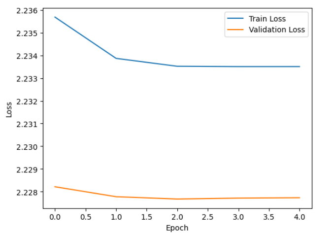
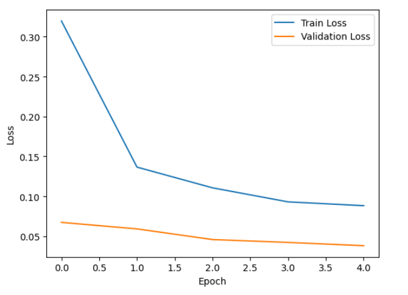
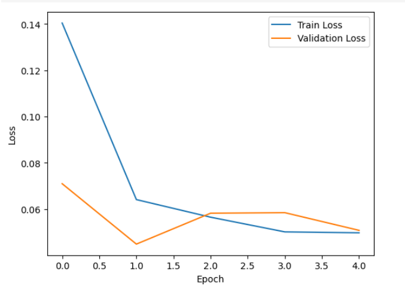

# MNIST Classification: LeNet-5, Improved LeNet-5, ResNet-18 and Hybrid CNN + Random Forest

## Introduction  
Automatic digit recognition on the MNIST dataset remains a standard benchmark for evaluating convolutional neural network (CNN) architectures and hybrid feature-based approaches. In this work we compare three CNN models of increasing capacity—LeNet-5 [1], an improved LeNet-5, and ResNet-18 [2]—trained end-to-end on MNIST, and further explore a hybrid pipeline that uses ResNet-18 as a fixed feature extractor combined with a Random Forest classifier. Our goal is to (i) analyze convergence behavior and final performance of each CNN, (ii) demonstrate the benefits of architectural enhancements, and (iii) assess the effectiveness of a classical ensemble on deep features.

## Method  
### Data and Preprocessing  
- Dataset: MNIST (60 000 training, 10 000 test images)  
- Transformations:  
  1. Resize to 32 × 32  
  2. ToTensor()  
  3. Normalize(mean=(0.1307,), std=(0.3081,))  
- DataLoader: batch size = 128, `num_workers = os.cpu_count() // 2`

### Models  
1. **LeNet-5** ([1])  
   – Two convolutional layers + pooling + two fully-connected layers, ReLU activations.  
2. **Improved LeNet-5**  
   – Extended filter counts, added batch normalization and dropout for better regularization.  
3. **ResNet-18** ([2])  
   – Eighteen-layer residual network; imported from `torchvision.models` without pretrained weights.

All three CNNs share:  
- Optimizer: Adam (lr=0.01, betas=(0.9, 0.999), weight_decay=1e-4)  
- Scheduler: OneCycleLR (max_lr=0.1, total_steps=5 epochs × steps_per_epoch, pct_start=0.3, cosine annealing)  
- Loss: CrossEntropyLoss  
- Training: 5 epochs, track train/validation loss and validation accuracy.

### Hybrid Model (ResNet-18 + Random Forest)  
1. Extract features from the penultimate layer of ResNet-18 on train/test sets; save as `.npy`.  
2. Train `RandomForestClassifier(n_estimators=100, random_state=42)` on the  features.  
3. Evaluate on test features.

## Results  
### Loss Curves  
**Figure 1. LeNet-5: train vs. validation loss**  
  

**Figure 2. Improved LeNet-5: train vs. validation loss**  
  

**Figure 3. ResNet-18: train vs. validation loss**  
  

### Hybrid Model Accuracy  
Random Forest accuracy on ResNet-18 features: 0.9702  

## Discussion  
- **Convergence speed & loss:**  
  LeNet-5 (Fig. 1) exhibits slow convergence and high final loss (≈2.233 train, 2.227 val), indicating limited capacity on resized MNIST. The improved LeNet-5 (Fig. 2) converges much faster, reaching <0.1 train loss and ~0.04 validation loss by epoch 5, thanks to added filters and regularization. ResNet-18 (Fig. 3) yields similar or slightly better loss curves than improved LeNet-5, demonstrating the power of residual connections in deeper networks.  
- **Hybrid approach:**  
  Extracting deep features from ResNet-18 and training a Random Forest yields 97.02 % test accuracy. This confirms that classical ensemble classifiers can effectively leverage fixed deep representations, offering a lightweight alternative when fine-tuning full networks is too costly.  
- **Trade-offs:**  
  - Pure CNNs require end-to-end GPU training but achieve state-of-the-art error rates.  
  - The hybrid pipeline decouples feature extraction (GPU) from classifier training (CPU), facilitating rapid experimentation and interpretability of feature importance.  

## References

[1] Y. LeCun, L. Bottou, Y. Bengio, P. Haffner, “Gradient-based learning applied to document recognition,” _Proceedings of the IEEE_, vol. 86, no. 11, pp. 2278-2324, 1998.  
[2] K. He, X. Zhang, S. Ren, J. Sun, “Deep residual learning for image recognition,” in _Proceedings of the IEEE Conference on Computer Vision and Pattern Recognition (CVPR)_, pp. 770-778, 2016.  
[3] A. Paszke et al., “PyTorch: An Imperative Style, High-Performance Deep Learning Library,” in _Advances in Neural Information Processing Systems 32_, pp. 8024-8035, 2019.  
[4] F. Pedregosa et al., “Scikit-learn: Machine Learning in Python,” _Journal of Machine Learning Research_, vol. 12, pp. 2825-2830, 2011.  
[5] L. N. Smith, “A disciplined approach to neural network hyper-parameters: Part 1 – learning rate, batch size, momentum, and weight decay,” arXiv preprint arXiv:1803.09820, 2018.
